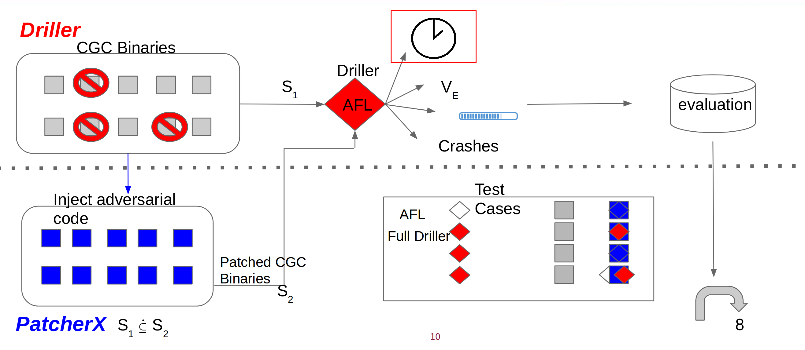

# Test Design
The test design for Filler.

## Understanding CGC
The binaries used in the CGC included multiple self-written system calls, seven to be exact. To best simulate a test of automation we decided to use 10 binaries used in the CGC on Driller--a Symbolic Executor wrapped aroound AFL. 

## Test Steps
1. 10 unpatched CGC binaries tested
  a. Against AFL
  b. Against Driler (AFL + SE)

2. Patch all 10 binaries to target Driller
3. 10 patched CGC binaries tested
  a. Against AFL
  b. Against Driller (AFL + SE)
  
4. Evaluate differences in 1 and 2

## Test Model

## Model Objectives
* Demonstrate behaviour change by constant demonstration
* Show the effectiveness of patches using AFL statistics
* Keep each patch constant 

## Technicals
### Testing
* [shellphuzz](https://github.com/shellphish/fuzzer) was used to activate Driller and AFL
  * the fuzz.stats object was used to collect data
